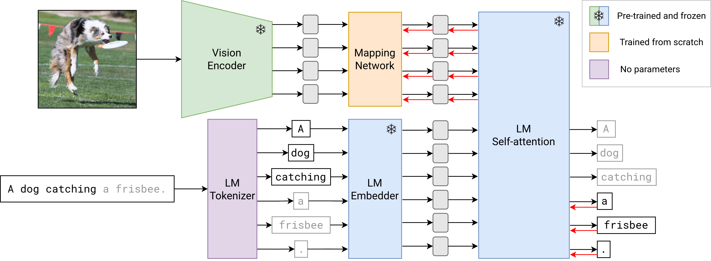

# MAPL

Official code for the EACL 2023 (main track) paper: [MAPL: Parameter-Efficient Adaptation of Unimodal Pre-Trained Models for Vision-Language Few-Shot Prompting](https://arxiv.org/abs/2210.07179)

## Approach



## Install dependencies

```bash
pip install torch transformers accelerate pillow
```

## Usage

```python
import torch
import urllib.request
from PIL import Image

device = torch.device('cuda' if torch.cuda.is_available() else 'cpu')

model = torch.hub.load('mair-lab/mapl', 'mapl')
model.eval()
model.to(device)

url = "http://images.cocodataset.org/val2017/000000039769.jpg"
image = Image.open(urllib.request.urlopen(url))
pixel_values = model.image_transform(image).unsqueeze(0).to(device)

prompt = "Please answer the question. Question: How many cats are there? Answer:"
input_ids = model.text_transform(prompt).input_ids.to(device)

with torch.cuda.amp.autocast(dtype=torch.bfloat16):
    generated_ids = model.generate(
        pixel_values=pixel_values,
        input_ids=input_ids,
        max_new_tokens=50,
        num_beams=5
    )

generated_text = model.text_processor.batch_decode(generated_ids, skip_special_tokens=True)[0].strip()
print(generated_text)  # prints: Two.
```

## Citation
If you're using MAPL in your research or applications, please cite our paper:
```bibtex
@misc{manas2022mapl,
    title={MAPL: Parameter-Efficient Adaptation of Unimodal Pre-Trained Models for Vision-Language Few-Shot Prompting},
    author={Oscar Mañas and Pau Rodriguez and Saba Ahmadi and Aida Nematzadeh and Yash Goyal and Aishwarya Agrawal},
    year={2022},
    eprint={2210.07179},
    archivePrefix={arXiv},
    primaryClass={cs.CV}
}
```
