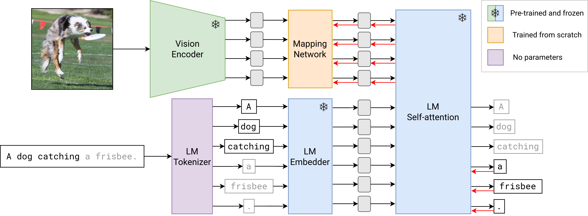

# MAPL

Official code for the EACL 2023 (main track) paper: [MAPL: Parameter-Efficient Adaptation of Unimodal Pre-Trained Models for Vision-Language Few-Shot Prompting](https://arxiv.org/abs/2210.07179)

## Approach



## Citation

```
@misc{manas2022mapl,
    title={MAPL: Parameter-Efficient Adaptation of Unimodal Pre-Trained Models for Vision-Language Few-Shot Prompting},
    author={Oscar Mañas and Pau Rodriguez and Saba Ahmadi and Aida Nematzadeh and Yash Goyal and Aishwarya Agrawal},
    year={2022},
    eprint={2210.07179},
    archivePrefix={arXiv},
    primaryClass={cs.CV}
}
```
